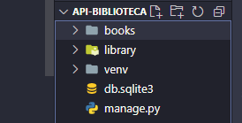
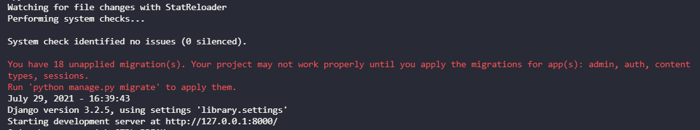
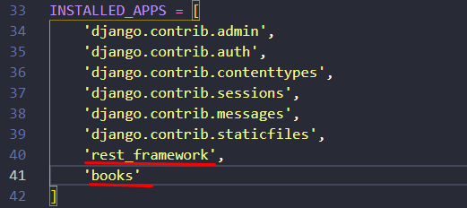

>Todo o conteúdo desse readme foi escrito beaseado nesse <a href="https://www.youtube.com/watch?v=wtl8ZyCbTbg&list=PLcM_74VFgRhpyCtsNXyBUf27ZRbyQnEEb">vídeo.</a> Espero que você aprenda algo novo!

# API para uma biblioteca
>O python facilita bastante coisas para a gente, como os serializers (que convertem objetos para strings na comunicação cliente-servidor) e os verbos http (GET, POST, PUT, DELETE) que de certa forma também vem por padrão. Não me aprofundei neles durante o readme porque também preciso entender melhor como essas coisas funcionam

* [Introdução](#introdução)
* [Preparando o Ambiente](#preparando-o-ambiente)
* [Projeto x App](#projeto-app)
* [Criando os modelos e API](#criando-os-modelos-e-api)
* [Criacao das rotas](#criacao-das-rotas)

# Introdução
A ideia do projeto é que possamos armazenar livros e seus atributos dentro de um banco de dados e gerenciar tudo isso sem precisar de uma interface gráfica. Assim, outra aplicação poderá se comunicar com a nossa de forma eficiente. Esse é o conceito de API (Aplication Programming Interface)

# Preparando o ambiente
Aqui temos a receita de bolo pra deixar a sua máquina pronta para levantar um servidor usando o django e receber aquele 200 bonito na cara

```bash
python -m venv venv #criando ambiente virtual na sua versao do python
./venv/Scripts/Activate.ps1 #Ativando o ambiente virtual
pip install django djangorestframework #instalação local das nossas dependências
```
A graça do ambiente virtual é que todas as suas dependências (e no python costumam são muitas) ficam apenas num diretório específico. Logo, você pode criar projetos que usam versões diferentes da mesma biblioteca sem que haja conflito na hora do import.

# Projeto x App
Ainda no terminal usamos os proximos comandos para criar o `project` que vai carregar nosso `app`. No django cada project pode carregar multiplos apps, como um site de esportes que pode ter um app para os artigos, outro para rankings etc.
```bash
django-admin startproject library . #ponto indica diretório atual
django-admin startapp books
python manage.py runserver #pra levantarmos o servidor local com a nossa aplicação
```
Sua estrutura de pastas deve estar assim:



Para criar as tabelas no banco de dados (Por enquanto *Sqlite3*) executamos o comando
```bash
python manage.py migrate
```
Isso evita que a notificação *unapplied migrations* apareça na próxima vez que você levantar o servidor 



# Criando os modelos e API
No arquivo **./library/settings.py** precisamos indicar ao nosso projeto library sobre a existência do app books e também o uso do rest framework. Portanto adicionamos as seguintes linhas sublinhadas



Agora em **./library/books/models.py** iremos criar nosso modelo com os atributos que um livro deve ter.

```py
from django.db import models
from uuid import uuid4

class Books(models.Model):
    #criando os atributos do livro
    id_book = models.UUIDField(primary_key=True, default=uuid4, editable=False)
    title = models.CharField(max_length=255)
    author = models.CharField(max_length=255)
    release_year = models.IntegerField()
```
## Serializers e Viewsets
Dentro de **./library/books** iremos criar a pasta **/api** com os arquivos 
* serializers.py 
* viewsets.py 

### Serializers
```py
from rest_framework import serializers
from books import models

class BooksSerializer(serializers.ModelSerializer):
    class Meta:
        model = models.Books
        fields = '__all__' #todos os campos do model id_book, author..
```

### Viewsets
```py
from django.db import models
from uuid import uuid4

class Books(models.Model):
    #criando os atributos do livro
    id_book = models.UUIDField(primary_key=True, default=uuid4, editable=False)
    title = models.CharField(max_length=255)
    author = models.CharField(max_length=255)
    release_year = models.IntegerField()
```
# Criacao das rotas
Agora com o viewset e o serializer a única coisa que falta é uma rota. Portanto vamos para **./library/urls.py** resolver esse problema

```py
from django.contrib import admin
from django.urls import path, include

from rest_framework import routers
from books.api import viewsets as booksviewsets
#criando nosso objeto de rota
route = routers.DefaultRouter()
route.register(r'books', booksviewsets.BooksViewSet, basename="Books")

urlpatterns = [
    path('admin/', admin.site.urls),
    path('', include(route.urls))
]
```
Como criamos um modelo novo lá em cima, precisamos avisar e em seguida migrar todos essas novas informações para o banco de dados

```bash
>python manage.py makemigrations 
>python manage.py migrate
>python manage.py runserver 
```
Agora você pode usar um programa como <a href="https://insomnia.rest/">Insomnia</a> para testar os métodos http no link do seu servidor local.

